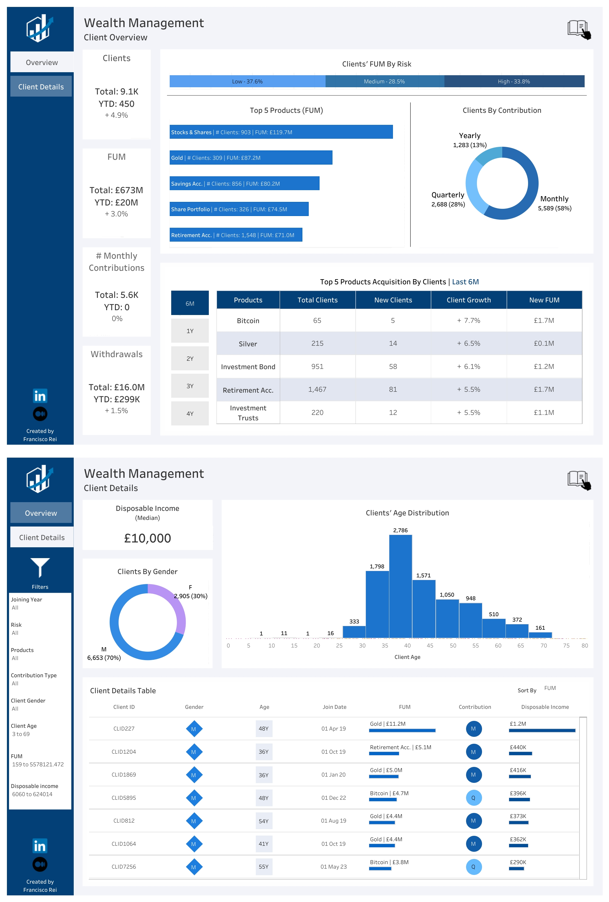
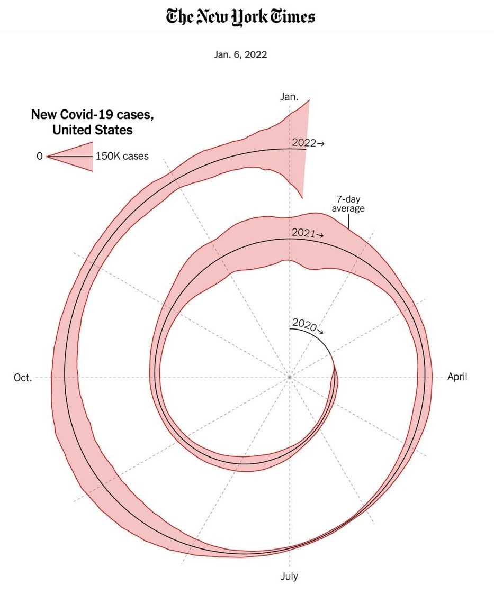

# Data Visualization

## Assignment 2: Good and Bad Data Visualization

### Requirements:

- Data visualizations are important tools for communication and convincing; we need to be able to evaluate the ways that data are presented in visual form to be critical consumers of information 
- To test your evaluation skills, locate two public data visualizations online, one good and one bad  
    - You can find data visualizations at https://public.tableau.com/app/discover or https://datavizproject.com/, or anywhere else you like! 
- For each visualization (good and bad):  
    - Explain (with reference to material covered up to date, along with readings and other scholarly sources, as needed) why you classified that visualization the way you did.

        ### [My Answer]

        #### Good Example

        

        This comprehensive data visualization is for wealth management overview and client details. I think it's quite effective for presenting wealth management data. The followings are the reasons why I think it’s a good data visualization. 
        - The visualizations are neatly organized, making it easy to navigate and understand different sections. 
        - The sidebar allows for quick filtering based on various attributes, enhancing interactivity. 
        - Colors are used effectively to differentiate categories and highlight important information. 
        - The gender distribution and client contribution pie charts use distinct colors for clear differentiation. 
        - The ability to sort by FUM in the client details table adds interactivity and enhances the usability of the data. 
        - Bar charts, pie charts, and tables are used appropriately for different types of data, aiding in quick comprehension. 

        #### Bad Example
        

        This spiral chart from The New York Times is a data visualization depicting new Covid-19 cases in the United States over time. The followings are the reasons why I think it’s a bad data visualization. 
        - The spiral design, while engaging, can be difficult to read and interpret, especially for viewers not familiar with this type of chart. 
        - It can be challenging to accurately compare values between different segments of the spiral due to the non-linear scale and the varying widths of the lines. 
        - The lack of clear axis labels and gridlines makes it difficult to determine exact values, which can be important for precise data interpretation. 
        - Key points such as the highest peaks or critical dates are not explicitly labeled, which could help viewers better understand the context. 
        - For an audience looking for quick, actionable insights, this chart may require more time to interpret than a straightforward line or bar chart. 
        - The visual complexity might overshadow the data's message, making it less accessible to a broad audience. 

      
    - How could this data visualization have been improved? 
        ### [My Answer]
        For the good example, I found some tables and charts are quite dense. It may help to break down complex tables into smaller segments. Also, it could provide some brief explanations for certain metrics (like what "FUM" stands for or why certain products are top-ranked).

        For the bad example, while the spiral chart is innovative and visually appealing, it comes with readability and interpretability challenges. For conveying complex time-series data, especially to a broad audience, more traditional visualizations such as line or bar charts might be more effective. 
        - Accompany the spiral chart with more conventional charts (e.g., line charts) to provide alternative views of the same data, catering to different audience preferences. 
        - Add more prominent and frequent axis labels along the spiral to help viewers interpret the data more easily. 
        - Include gridlines or radial markers to assist in visualizing exact values at different points in the spiral. 
        - Use a minimalist color scheme to focus attention on the data. Avoid overly bright or clashing colors that might distract from the information. 
        - Introduce subtle visual aids, such as shading or background lines, to guide comparisons between different segments of the spiral representing different years. 

  
- Word count should not exceed (as a maximum) 500 words for each visualization (i.e. 
300 words for your good example and 500 for your bad example)

### Why am I doing this assignment?:

- This assignment ensures active participation in the course, and assesses the learning outcomes
* Apply general design principles to create accessible and equitable data visualizations
* Use data visualization to tell a story

### Rubric:

| Component               | Scoring   | Requirement                                                 |
|-------------------------|-----------|-------------------------------------------------------------|
| Data viz classification and justification | Complete/Incomplete | - Data viz are clearly classified as good or bad - At least three reasons for each classification are provided - Reasoning is supported by course content or scholarly sources |
| Suggested improvements  | Complete/Incomplete | - At least two suggestions for improvement - Suggestions are supported by course content or scholarly sources |

## Submission Information

🚨 **Please review our [Assignment Submission Guide](https://github.com/UofT-DSI/onboarding/blob/main/onboarding_documents/submissions.md)** 🚨 for detailed instructions on how to format, branch, and submit your work. Following these guidelines is crucial for your submissions to be evaluated correctly.

### Submission Parameters:
* Submission Due Date: `HH:MM AM/PM - DD/MM/YYYY`
* The branch name for your repo should be: `assignment-2`
* What to submit for this assignment:
    * This markdown file (assignment_2.md) should be populated and should be the only change in your pull request.
* What the pull request link should look like for this assignment: `https://github.com/<your_github_username>/visualization/pull/<pr_id>`
    * Open a private window in your browser. Copy and paste the link to your pull request into the address bar. Make sure you can see your pull request properly. This helps the technical facilitator and learning support staff review your submission easily.

Checklist:
- [ ] Create a branch called `assignment-2`.
- [ ] Ensure that the repository is public.
- [ ] Review [the PR description guidelines](https://github.com/UofT-DSI/onboarding/blob/main/onboarding_documents/submissions.md#guidelines-for-pull-request-descriptions) and adhere to them.
- [ ] Verify that the link is accessible in a private browser window.

If you encounter any difficulties or have questions, please don't hesitate to reach out to our team via our Slack at `#cohort-3-help`. Our Technical Facilitators and Learning Support staff are here to help you navigate any challenges.
